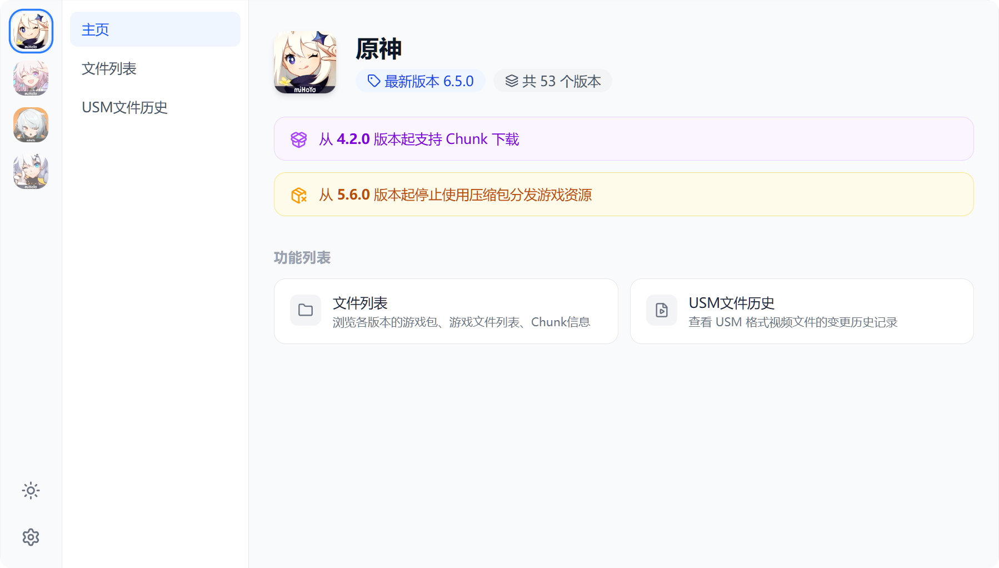

  <h1>Hoyo Files v3</h1>
  

    在线访问
    <a href="https://hoyo-files.amarea.cn/">
      EdgeOne
    </a>
    |
    <a href="https://files.hk4e.com/">
      Vercel
    </a>
  

  

## 项目说明

米哈游相关游戏资源包与文件列表查看工具，支持通过 Chunk 下载文件

## 支持游戏

- 原神 CN
  - 完整支持
- 崩坏：星穹铁道 CN
  - 文件列表不支持加载语音包
- 绝区零 CN
  - 完整支持
- 崩坏3 CN
  - 历史数据缺失
  - 文件列表不全

## 功能列表

- 文件列表
  - 列出游戏包列表
  - 列出更新包列表
  - 列出游戏文件列表
  - 列出语音包文件列表 
  - 查看 Chunk 信息
  - 通过直链下载文件
  - 通过 Chunk 下载文件（需安装 HeaderEditor 拓展并导入规则）
- USM 文件历史
  - 查看全部版本的 USM 文件历史记录
  - 按照版本查看 USM 文件变更记录
  - 下载 USM 文件的指定版本
- 亮色 / 暗色 主题切换
- 移动端适配
